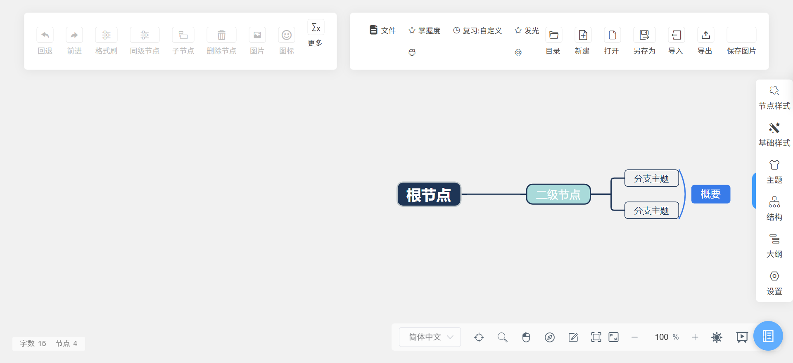

# Mind Map Review

[](./LICENSE)
[](https://tokewer.github.io/mind-map-main/)

A modern web mind map application focusing on **knowledge organization and Ebbinghaus spaced repetition review**. Supports multi-layout mind map editing, spaced repetition scheduling, automatic mastery tracking, flashcards, workspace import/export, and offline-first local folder persistence.

[中文文档 (Chinese)](./README.md) | English

---

## 🌟 Live Demo

- **GitHub Pages Demo**: [https://tokewer.github.io/mind-map-main/](https://tokewer.github.io/mind-map-main/)
- Open in browser to start mapping and reviewing. Data is stored safely in your browser's local storage.

---

## 🚀 Key Features

1. **Structured Mind Mapping**: Support for mind maps, logical structure diagrams, org charts, directory trees, timelines, fishbone diagrams, rich text, KaTeX formulas, images, icons, tags, and notes.
2. **Ebbinghaus Spaced Repetition**: Built-in memory schedules, mastery tracking based on review ratings (remembered/fuzzy/forgotten), due review alerts, and review float panel.
3. **Flashcards**: Attach Q&A, cloze, or judgment cards to any node. Import/export cards via Markdown.
4. **Dual Execution Modes**:
   - **Static Mode (GitHub Pages)**: Runs completely in-browser with zero backend requirement using `localStorage`.
   - **Local Mode (Python Server)**: Built-in `server.py` persists files and images to disk automatically.
---

## 🖼️ UI Preview




---

## 💻 Quick Start

### Requirements
- Node.js >= 16 (Node.js 18 or 20 recommended)
- Python 3.7+ (optional, only needed for local folder storage server)

### Local Server Launch
```bash
# Launch with built-in server (data persists to local folder)
python server.py
# Access http://127.0.0.1:8080 in your browser
```

### Web Development & Build
```bash
cd web
npm install
npm run serve # Dev server with HMR
npm run build # Production build
```

---

## 📄 License & Attribution

- Licensed under the **[MIT License](./LICENSE)**.
- Base mind map engine derived from `simple-mind-map` (Copyright (c) 2021-2023 The MindMap Team, MIT License).
- See **[NOTICE.md](./NOTICE.md)** for full third-party attribution and legal notices.
